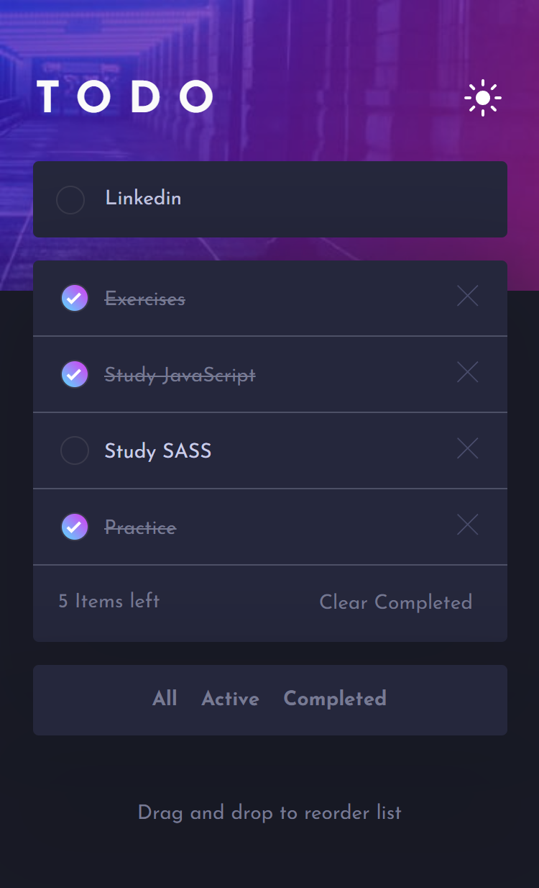
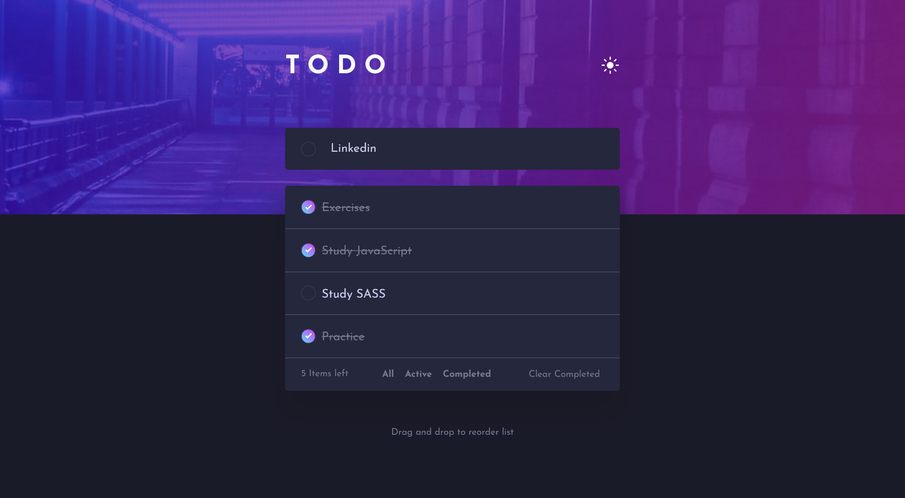

# TODO LIST
Solução para criar uma lista de tarefas interativa, capaz de adicionar novas tarefas, marcar as concluídas, excluir individualmente qualquer tarefa ou só as marcadas como feitas, e filtra-las, mostrando apenas às que desejar, completas ou pendentes.

## Índice

- [Visão geral](#visao-geral)
  - [O Desafio](#o-desafio)
  - [Screenshot](#screenshot)
- [Resultado](#resultado)
- [Minha caminhada](#minha-caminhada)
  - [Propriedades](#propriedades)
  - [O que aprendi](#o-que-aprendi)
  - [Recursos](#recursos)
- [Autor](#autor)

## Visão Geral

### O Desafio

Os usuários devem ser capazes de:

- Visualizar o tamanho dos elementos ajustados com base no tamanho da tela do dispositivo (mobile e desktop)

- Visualizar os estados de foco para todos os elementos interativos na página

- Adicionar novas tarefas a sua lista

- Marcar as tarefas como completas

- Excluir individualmente uma tarefa

- Excluir todas as tarefas completas

- Filtrar por todos/ativos/completos

- Ajustar o tema de cores com base em sua preferência

### Screenshots

<html>
  <h4>Layout mobile tema padrão</h4>
  
  <h4>Layout mobile tema claro</h4>
  
  <h4>Layout desktop tema padrão</h4>
  
  <h4>Layout desktop tema claro</h4>
  
  <h1>Testando funcionalidades</h1>
  
</html>

## Resultado: [Veja como ficou!](https://todo-list-pedroalima.vercel.app/)

## Minha caminhada

1º dia
- [x] Preparativos em mobile first

2º dia
- [x] Layout mobile

3º dia
- [x] Layout desktop
- [x] Estados de foco

4º dia
- [x] Feature de temas
- [x] Feature de adicionar tarefas

5º dia
- [x] Feature de excluir uma tarefa

6º dia
- [x] Feature de limpar tarefas completas

7º dia
- [x] Feature de filtar tarefas
- [x] Feature de tarefas restantes

### Propriedades

- Mobile-first
- Semântica HTML
- CSS BEM
- CSS Flexbox
- JavaScript DOM manipulation

### Meu aprendizado
Esse projeto foi essencial para me introduzir na criação de elementos DOM via JavaScript. Na construção da estrutura HTML optei por utilizar uma lista ("ul") para incluir as tarefas, acredito que seja o caminho mais lógico, onde cada tarefa seria um item da lista ("li"). Dessa forma, é crucial a manipulação do DOM para incluir cada tag e atributo, necessário dentro do contêiner.

Trechos de destaque:

HTML
```html
...
<li class="todo__item">
  <input type="checkbox" id="checkbox">
  <label>Exercises</label>
  <i></i>
</li>
...
```
JavaScript
```javascript
...
// Variáveis
const todoInput = document.querySelector("#todoInput");
const todoForm = document.querySelector("#todoForm");

// Funções
const createTodo = (text) => {
    const todo = document.createElement("li");
    todo.classList.add("todo__item");

    const todoCheckbox = document.createElement("input");
    todoCheckbox.setAttribute("type", "checkbox");
    todoCheckbox.setAttribute("id", "checkbox");
    todo.appendChild(todoCheckbox);

    const todoLabel = document.createElement("label");
    todo.appendChild(todoLabel);
    todoLabel.innerText = text;

    const todoIcon = document.createElement("i");
    todoIcon.innerHTML = '';
    todo.appendChild(todoIcon);

    const todoFooter = document.querySelector(".todo__item-footer");
    todoList.insertBefore(todo, todoFooter);
}

// Eventos
todoForm.addEventListener('submit', (e) => {
    e.preventDefault();
    const inputValue = todoInput.value;

    if (inputValue) {
        createTodo(inputValue);
    };
});
...
```

### Recursos

- [JS - .addEventListener() na MDN](https://developer.mozilla.org/pt-BR/docs/Web/API/EventTarget/addEventListener) - Esse artigo vai te ajudar a entender como utilizar o método de instância.

- [JS - If...else na MDN](https://developer.mozilla.org/pt-BR/docs/Web/JavaScript/Reference/Statements/if...else) - Esse artigo vai te ajudar a entender como utilizar a condicional.

- [O desafio da Frontend Mentor](https://www.frontendmentor.io/challenges/todo-app-Su1_KokOW) - Neste link você encontrará o desafio solucionado aqui.

## Autor

- LinkedIn - [Pedro A. Lima](https://www.linkedin.com/in/pedrolima626/)
